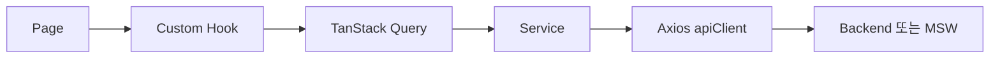
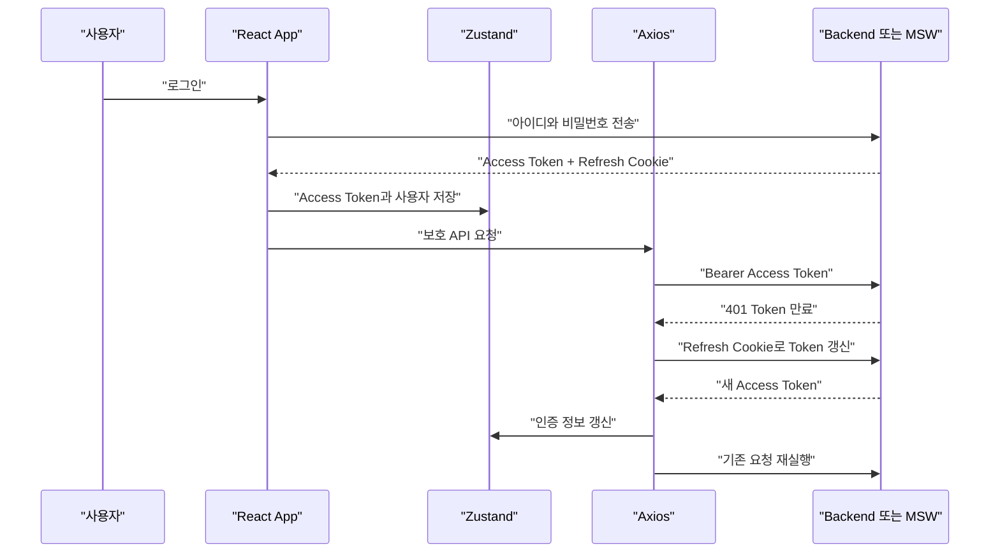

<div align="center">

# Basic Web Structure

**React 기반 관리자 대시보드의 인증, 권한, API, 레이아웃 기본 구조**


</div>

---

## 프로젝트 소개

이 프로젝트는 관리자용 웹 애플리케이션을 빠르게 시작할 수 있도록 만든 React 기본 구조입니다.

단순한 화면 예제가 아니라 다음과 같은 실제 프로젝트의 공통 문제를 미리 구조화하는 것을 목적으로 합니다.

- 로그인 및 인증 상태 복원
- Access Token 자동 갱신
- 사용자 역할별 페이지 접근 제어
- 공통 API Client와 서버 데이터 캐시
- TopNav와 접이식 Sidebar 기반 레이아웃
- 라이트·다크 테마와 다국어 지원
- 사용자 목록의 검색, 정렬과 페이지 이동

---

## 주요 기능

| 영역 | 구현 내용 |
|---|---|
| 인증 | Access Token과 Refresh Token 기반 로그인 |
| Token 관리 | Access Token은 메모리, Refresh Token은 HttpOnly Cookie 사용 |
| 자동 갱신 | API에서 401 발생 시 Token 갱신 후 기존 요청 재실행 |
| 권한 | 관리자, 운영자, 조회자 역할별 페이지 접근 제한 |
| API | Axios 공통 Client와 기능별 Service 분리 |
| 서버 상태 | TanStack Query를 통한 캐시, 로딩과 오류 처리 |
| Mock API | MSW를 사용한 인증, 권한, 사용자와 Health API |
| Layout | TopNav, 접이식 Sidebar와 Outlet 기반 공통 화면 |
| Theme | CSS Variable 기반 Light/Dark Theme |
| 다국어 | i18next 기반 한국어와 영어 전환 |
| Table | TanStack Table 기반 검색, 정렬과 페이지 처리 |

---

## 사용 기술

### Frontend 기반

| 기술 | 사용 목적 |
|---|---|
| React 19 | 컴포넌트 기반 UI 구성 |
| TypeScript 6 | Props, API 응답과 상태의 타입 검사 |
| Vite 8 | 개발 서버와 Production Build |
| React Router 8 | URL, Layout, 인증 및 권한 Route 연결 |

### UI와 스타일

| 기술 | 사용 목적 |
|---|---|
| Tailwind CSS 4 | Utility Class와 Theme 스타일 구성 |
| shadcn/ui | 프로젝트가 직접 소유하는 공통 UI |
| Base UI | 접근성을 고려한 UI 동작 |
| Lucide React | 공통 아이콘 |
| clsx | 조건부 Class 조합 |
| tailwind-merge | Tailwind Class 충돌 제거 |
| CVA | 공통 컴포넌트 Variant 관리 |
| Geist | 프로젝트 기본 글꼴 |

### 상태와 통신

| 기술 | 사용 목적 |
|---|---|
| Zustand | Theme와 인증 상태 관리 |
| TanStack Query | 서버 데이터 캐시와 요청 상태 관리 |
| Axios | Backend HTTP 요청과 인증 Interceptor |
| MSW | 개발 환경 Mock API |
| TanStack Table | 사용자 목록 검색, 정렬과 페이지 처리 |

### 지원 기능

| 기술 | 사용 목적 |
|---|---|
| i18next | 한국어와 영어 번역 |
| ESLint | 코드 오류와 규칙 검사 |
| EditorConfig | 공백 2칸 등 기본 포맷 통일 |

---

## 전체 구조

```text
src
├─ api                   # Axios, JWT Header, 401 Token 갱신
├─ assets                # 이미지와 정적 파일
├─ components            # 재사용 UI 컴포넌트
│  ├─ common             # AuthProvider 등 앱 공통 요소
│  ├─ layout             # TopNav, Sidebar, AppLayout
│  ├─ ui                 # 프로젝트가 소유하는 shadcn/ui
│  └─ users              # 사용자와 계정 메뉴 컴포넌트
├─ config                # 역할별 접근 경로 등 공통 정책
├─ hooks                 # TanStack Query와 화면 상태 연결
├─ locales               # 한국어와 영어 번역
├─ mocks                 # MSW Handler와 Mock 데이터
│  └─ handlers           # 인증, 사용자, Health Handler
├─ pages                 # Route 화면, Login, 403, 404
├─ routes                # URL, 로그인과 역할별 접근 제어
├─ services              # 기능별 Backend API 호출
├─ stores                # Theme와 인증 메모리 상태
├─ styles                # 전역 스타일과 Theme 변수
├─ types                 # DTO와 사용자 역할 계약
└─ utils                 # 날짜, Class 조합 등 공통 함수
```

---

## API 처리 흐름



각 계층의 역할은 다음과 같습니다.

### Page

화면을 구성하고 Hook을 사용합니다.

Page에서 Axios를 직접 호출하거나 긴 데이터 처리 로직을 작성하지 않습니다.

### Hook

TanStack Query와 화면을 연결합니다.

```ts
function useUsers() {
  return useQuery({
    queryKey: ["users"],
    queryFn: UserService.getUsers,
  });
}
```

### Service

기능별 API 주소와 응답 구조를 관리합니다.

```ts
async function getUsers(): Promise<UserDto[]> {
  const response = await apiClient.get<UserDto[]>(
    "/users",
  );

  return response.data;
}
```

### API Client

다음 공통 통신 정책을 처리합니다.

- 공통 `baseURL`
- 요청 제한 시간
- JSON Header
- Cookie 전송
- Access Token Header 추가
- 401 응답 시 Token 갱신
- Token 갱신 후 기존 요청 재실행

---

## 인증 구조



### Token 저장 정책

| 정보 | 저장 위치 | 이유 |
|---|---|---|
| Access Token | Zustand 메모리 | 브라우저 저장소 노출 방지 |
| Refresh Token | HttpOnly Cookie | JavaScript에서 접근할 수 없게 제한 |
| 사용자 정보 | Zustand 메모리 | 여러 화면에서 현재 사용자 공유 |
| 서버 조회 결과 | TanStack Query | 서버 데이터 캐시와 갱신 관리 |

브라우저를 새로고침하면 Access Token은 사라집니다.

`AuthProvider`가 Refresh Cookie를 이용해 새로운 Access Token과 사용자 정보를 복원합니다.

---

## 권한 구조

인증과 권한 검사를 분리했습니다.

### ProtectedRoute

사용자가 로그인했는지 확인합니다.

로그인하지 않은 사용자는 `/login`으로 이동합니다.

### AccessRoute

로그인한 사용자가 요청한 페이지를 볼 수 있는지 확인합니다.

권한이 없으면 `/forbidden`으로 이동합니다.

### access.ts

역할별 허용 경로를 한곳에서 관리합니다.

```ts
const pathsByRole = {
  administrator: [
    "/",
    "/users",
    "/monitor",
    "/history",
    "/settings",
    "/structure",
    "/libraries",
  ],

  operator: [
    "/",
    "/monitor",
    "/history",
    "/structure",
    "/libraries",
  ],

  viewer: [
    "/",
    "/monitor",
    "/structure",
    "/libraries",
  ],
};
```

Sidebar와 AccessRoute가 같은 설정을 사용합니다.

따라서 다음 기준이 서로 달라지지 않습니다.

- Sidebar 메뉴 표시
- URL 직접 입력 접근
- 사용자 메뉴의 설정 표시

> 프론트엔드 권한 검사는 보안 기능의 전부가 아닙니다.  
> 실제 Backend에서도 모든 보호 API에 대해 사용자 인증과 역할 검사를 다시 수행해야 합니다.

---

## Layout 구조

```text
AppLayout
├─ TopNav
│  ├─ Brand
│  ├─ LanguageSelect
│  ├─ ThemeButton
│  └─ UserMenu
│
├─ Sidebar
│  ├─ 역할별 주 메뉴
│  ├─ 프로젝트 안내 메뉴
│  └─ 설정 메뉴
│
└─ Outlet
   └─ 현재 Route의 Page
```

`AppLayout`은 모든 보호 화면에서 공통으로 사용합니다.

Sidebar는 열림과 닫힘 상태에 따라 너비가 변경됩니다.

```text
열림: 15rem
닫힘: 4.5rem
```

본문은 `minmax(0, 1fr)`를 사용해 Sidebar를 제외한 남은 공간을 차지합니다.

---

## Theme 구조

Theme는 Zustand와 CSS Variable을 사용합니다.

```text
ThemeButton
    ↓
useThemeStore
    ↓
ThemeProvider
    ↓
document.documentElement.dataset.theme
    ↓
CSS Variable 변경
```

컴포넌트에서 색상 값을 직접 작성하기보다 다음 Theme Class를 사용합니다.

```text
bg-page
bg-panel
bg-panel-soft
text-main
text-sub
border-line
bg-brand
text-brand
```

이 방식은 화면 코드를 수정하지 않고도 프로젝트 색상 체계를 변경할 수 있게 합니다.

---

## 다국어 구조

번역 문구는 컴포넌트에 직접 작성하지 않고 JSON으로 관리합니다.

```text
src/locales
├─ ko/common.json
└─ en/common.json
```

사용자가 선택한 언어는 브라우저 저장소에 보관하고 i18next를 통해 즉시 화면에 반영합니다.

---

## MSW 개발 환경

Backend가 없는 개발 단계에서는 MSW가 실제 HTTP 요청을 가로채 응답합니다.

현재 Mock으로 검증하는 기능은 다음과 같습니다.

- Health 상태 조회
- 사용자 목록 조회
- 로그인
- Access Token 발급
- Refresh Token Cookie
- Access Token 만료
- Token 자동 갱신
- 로그아웃
- 사용자 역할별 API 접근 거부

MSW는 개발 환경에서만 실행됩니다.

```env
VITE_USE_MOCK=true
VITE_API_URL=/api
VITE_AUTO_ADMIN_LOGIN=false
```

Production Build나 Preview에서는 MSW가 자동으로 실행되지 않습니다.

---

## 실행 방법

### 패키지 설치

```bash
npm install
```

### 개발 서버

```bash
npm run dev
```

### 코드 검사

```bash
npm run lint
```

### Production Build

```bash
npm run build
```

### Build 결과 확인

```bash
npm run preview
```

---

## 코드 작성 규칙

### 경로

상대경로를 길게 작성하지 않고 `@` 절대경로를 사용합니다.

```ts
import apiClient from "@/api/apiClient";
import UserService from "@/services/UserService";
```

### 들여쓰기

`.editorconfig`를 기준으로 공백 2칸을 사용합니다.

### API 요청

Page나 Component에서 Axios를 직접 호출하지 않습니다.

```text
Page → Hook → Service → apiClient
```

### 상태 구분

| 상태 종류 | 관리 도구 |
|---|---|
| Theme, 인증 사용자 | Zustand |
| API 응답과 서버 캐시 | TanStack Query |
| 입력값과 일시적인 UI 상태 | React useState |

### 공통 UI

Button, Card, Select, Avatar와 Dropdown Menu는 `components/ui`의 공통 컴포넌트를 사용합니다.

---

## 검증 명령어

변경 후 다음 명령을 실행합니다.

```bash
npm run lint
npm run build
```

현재 기준:

- TypeScript Build 성공
- Vite Production Build 성공
- ESLint 오류 없음

---

## 향후 개별 개발 방향

- 사용자 생성 및 수정
- 역할과 권한 관리 화면
- Backend JWT 인증 연결
- SignalR 실시간 상태 수신
